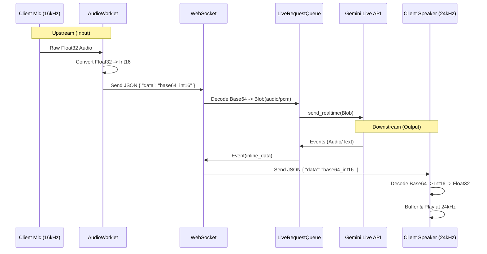

# Ultimate Technical Guide: Google ADK Voice Implementation

This document contains **every technical detail** required to implement real-time bidirectional voice with Google's Agent Development Kit (ADK) and Gemini Live API.

---

## 1. System Architecture & Data Flow



---

## 2. Audio Engineering Specifications (THE CRITICAL PART)

If you get these wrong, the audio will pitch-shift (chipmunk/demon voice) or fail completely.

### Input (Microphone -> Gemini)
*   **Sample Rate**: `16,000 Hz` (Mandatory for ADK best results)
*   **Channels**: `1` (Mono)
*   **Bit Depth**: `16-bit` Integer (PCM)
*   **Encoding**: Little Endian
*   **Web Audio API Nuance**: Browsers capture audio as `Float32` (-1.0 to 1.0). You **MUST** convert this to `Int16` (-32768 to 32767) before sending.

**Frontend Conversion Logic (JS):**
```javascript
// float32 input from AudioWorklet
// int16 output to be sent to server
for (let i = 0; i < inputData.length; i++) {
    // Scale -1.0..1.0 to -32768..32767
    let s = Math.max(-1, Math.min(1, inputData[i]));
    outputData[i] = s < 0 ? s * 0x8000 : s * 0x7FFF;
}
```

### Output (Gemini -> Speaker)
*   **Sample Rate**: `24,000 Hz` (Standard Gemini output)
*   **Channels**: `1` (Mono)
*   **Bit Depth**: `16-bit` Integer (PCM)

---

## 3. WebSocket Protocol Schema

The communication happens over a standardized JSON protocol.

### A. Client -> Server (Upstream)

**1. Verification/Setup (Implicit)**
Connect to `ws://host/ws/{session_id}?is_audio=true`.

**2. Sending Audio**
```json
{
  "mime_type": "audio/pcm", 
  "data": "<BASE64_STRING_OF_RAW_INT16_BYTES>"
}
```
*   **Frequency**: Send chunks every ~20ms-100ms for low latency.
*   **Do NOT** send WAV headers. Raw PCM only.

**3. Sending Text/Commands**
```json
{
  "mime_type": "text/plain",
  "data": "Hello, are you there?"
}
```

### B. Server -> Client (Downstream)

**1. Audio Chunk (The Voice)**
```json
{
  "type": "audio",
  "data": "<BASE64_STRING_OF_RAW_INT16_BYTES_AT_24KHZ>",
  "turn_complete": false
}
```

**2. Text Transcription (What User Said)**
```json
{
  "type": "user_transcript",
  "data": "What is the weather?",
  "turn_complete": false,
  "is_final": true
}
```

**3. Model Transcription (What Agent is Saying)**
```json
{
  "type": "text", 
  "data": "It is sunny today.",
  "turn_complete": false
}
```

**4. Interruption Signal**
```json
{
  "type": "interrupted",
  "data": "User spoke while agent was talking"
}
```
*   *Client Action*: Immediately clear audio playout buffer to stop the agent from finishing the sentence.

---

## 4. Backend Implementation Details (Python/ADK)

### Essential Setup
You need a `LiveRequestQueue` and a `Runner`.

```python
# 1. Configuration for Voice
run_config = RunConfig(
    response_modalities=["AUDIO"],  # FORCE AUDIO
    speech_config=types.SpeechConfig(
        voice_config=types.VoiceConfig(
            prebuilt_voice_config=types.PrebuiltVoiceConfig(
                voice_name="Puck" # Options: Puck, Charon, Kore, Fenrir, Aoede
            )
        )
    )
)

# 2. Sending Audio to Gemini (Inside WebSocket loop)
# data_bytes = base64.b64decode(msg['data'])
audio_blob = types.Blob(
    mime_type="audio/pcm;rate=16000", # Must match client recording rate
    data=data_bytes
)
live_request_queue.send_realtime(audio_blob) 
# Use send_realtime, NOT send_content for audio!
```

### The "Double Loop" Pattern
You cannot wait for `await websocket.receive()` inside the `runner.run_live()` loop. They must be concurrent.

```python
async def socket_handler(ws):
    # Task 1: Phone -> Gemini
    async def listen_to_client():
        async for msg in ws.iter_text():
            # decode -> queue.send_realtime()
            
    # Task 2: Gemini -> Phone
    async def listen_to_agent():
        async for event in runner.run_live(...):
             # event -> encode -> ws.send_text()

    # Run both!
    await asyncio.gather(listen_to_client(), listen_to_agent())
```

---

## 5. Frontend Implementation Checklist

To build the client, you need:

1.  **AudioContext (Input)**: `new AudioContext({ sampleRate: 16000 })`
    *   *Note*: Some browsers ignore the requested sample rate. You might need a **resampler** if the browser forces 44.1kHz or 48kHz.
2.  **AudioWorklet (Recording)**:
    *   buffer input float32 samples.
    *   convert to int16.
    *   flush to main thread via `port.postMessage`.
3.  **WebSocketWorker**:
    *   Receive int16 buffers.
    *   Base64 encode (`btoa` or `ArrayBuffer` to base64).
    *   Send to WS.
4.  **AudioContext (Output)**: `new AudioContext({ sampleRate: 24000 })`
    *   *Note*: Gemini audio is 24kHz. If your output context is 48kHz, you need to upsample, or let the browser handle it (usually automatic if you set buffer correctly).
5.  **Jitter Buffer**:
    *   Do not play audio chunks immediately. Push them into a queue.
    *   Schedule playback: `nextStartTime = Math.max(ctx.currentTime, nextStartTime) + chunkDuration`.

## 6. Common Pitfalls & Fixes

| Symptom | Cause | Fix |
| :--- | :--- | :--- |
| **"Demon Voice" (Slow/Low)** | Sending 48kHz audio but telling Gemini it's 16kHz | Downsample client audio to 16kHz before sending. |
| **"Chipmunk Voice" (Fast/High)** | Playing 24kHz Gemini audio on a 48kHz context without accounting for timing | Explicitly set AudioContext source buffer sample rate or resample. |
| **High Latency** | Using `send_content()` instead of `send_realtime()` | Switch to `send_realtime()` for streaming. |
| **Echo / Self-Hearing** | Agent hears itself from the speaker | Use headphones or implement AEC (Acoustic Echo Cancellation) - *Advanced*. |
| **Connection Drops** | No activity for too long | Implement a heartbeat/ping in WebSocket. |

## 7. Configuration Reference (`.env`)

```env
GOOGLE_API_KEY=AIzaSy...
# Optional: Vertex AI settings
GOOGLE_CLOUD_PROJECT=...
GOOGLE_CLOUD_LOCATION=us-central1
```
